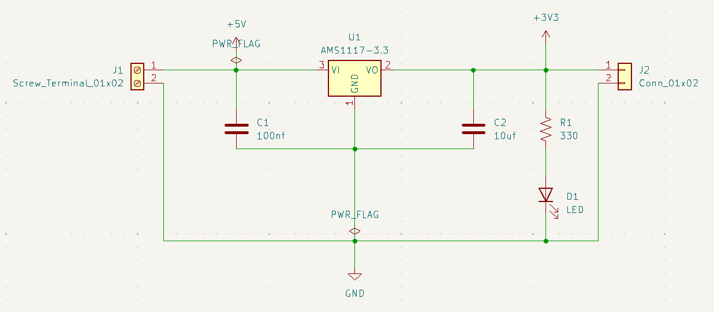
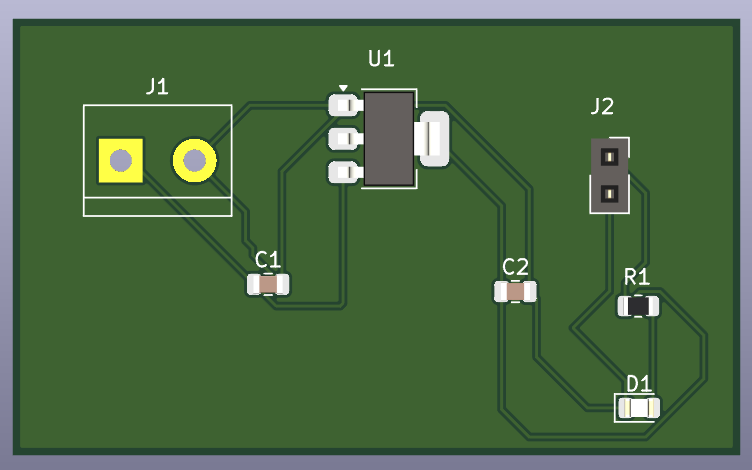
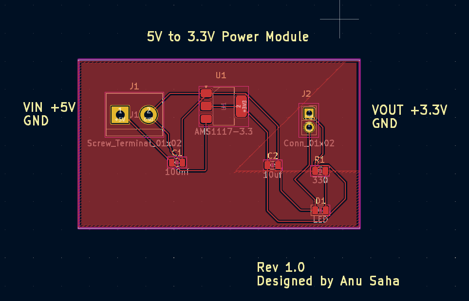
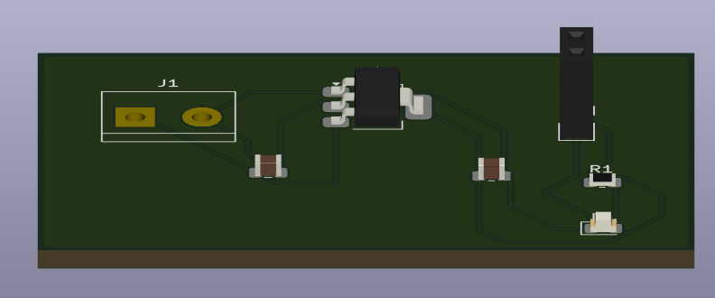

# 5V to 3.3V Power Module

A compact linear power supply module designed using **KiCad** to convert **5V input to a stable 3.3V output**.  
This project covers the complete PCB design workflow — from schematic capture to PCB layout, routing, and Gerber generation for fabrication.

---

## 🔧 Features

- Converts **5V DC input to regulated 3.3V output**
- Based on **AMS1117-3.3** linear voltage regulator
- Input and output via **screw terminal / pin header**
- Includes input/output decoupling capacitors for stability
- Power indication LED with current-limiting resistor
- Compact single-layer PCB layout
- Fabrication-ready Gerber and drill files included

---

## 📐 Schematic

The schematic was designed in KiCad following standard power supply design practices, including proper decoupling and grounding.

> *(See schematic file in repository)*  
`5V_to_3V3_Power_Module.kicad_sch`

---

## 🧩 PCB Layout

- Fully routed PCB with labeled connectors
- Clear silkscreen markings for **VIN, GND, VOUT**
- Ground copper fill for improved performance
- Designed as **Rev 1.0**

### PCB Views

#### Schematic

#### Top View

#### Annotated PCB Layout

#### 3D View

---

## 🏭 Manufacturing Files

All fabrication-ready files are provided.

📁 **gerbers/**
- Copper layers
- Silkscreen
- Solder mask
- Board outline (Edge.Cuts)
- Drill files (PTH / NPTH)

These Gerbers can be directly uploaded to PCB manufacturers such as **JLCPCB**, **PCBWay**, or **Seeed Studio**.

---

## 🛠 Tools Used

- **KiCad 8.0**
- Git & GitHub for version control

---

## 👩‍💻 Designed By

**Anu Saha**  
Electronics & Telecommunication Engineering  
PCB Design | KiCad | Hardware Projects

